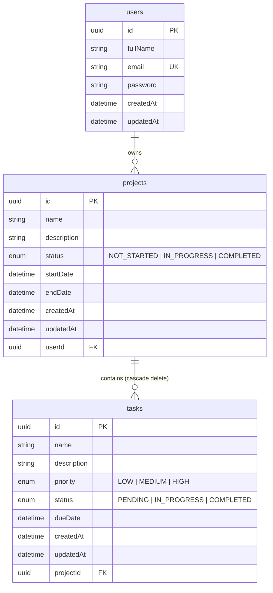

# Database Architecture & Entity-Relationship (ER) Diagram

The Project Management System uses PostgreSQL (v16) managed via Prisma ORM.

## Entity Relationship (ER) Diagram

---

## Schema Models & Field Definitions

### 1. `users` Table
- `id` (UUID, Primary Key, auto-generated)
- `fullName` (VARCHAR(100), Required)
- `email` (VARCHAR(255), Unique, Required, Lowercase)
- `password` (VARCHAR(255), Bcrypt hash with 10 salt rounds)
- `createdAt` (TIMESTAMP, default `now()`)
- `updatedAt` (TIMESTAMP, auto-updated)

### 2. `projects` Table
- `id` (UUID, Primary Key, auto-generated)
- `name` (VARCHAR(150), Required)
- `description` (TEXT, Optional)
- `status` (Enum: `NOT_STARTED`, `IN_PROGRESS`, `COMPLETED`, default: `NOT_STARTED`)
- `startDate` (TIMESTAMP, Optional)
- `endDate` (TIMESTAMP, Optional)
- `userId` (UUID, Foreign Key referencing `users.id` with `onDelete: Cascade`)
- `createdAt` (TIMESTAMP, default `now()`)
- `updatedAt` (TIMESTAMP, auto-updated)

### 3. `tasks` Table
- `id` (UUID, Primary Key, auto-generated)
- `name` (VARCHAR(150), Required)
- `description` (TEXT, Optional)
- `priority` (Enum: `LOW`, `MEDIUM`, `HIGH`, default: `MEDIUM`)
- `status` (Enum: `PENDING`, `IN_PROGRESS`, `COMPLETED`, default: `PENDING`)
- `dueDate` (TIMESTAMP, Optional)
- `projectId` (UUID, Foreign Key referencing `projects.id` with `onDelete: Cascade`)
- `createdAt` (TIMESTAMP, default `now()`)
- `updatedAt` (TIMESTAMP, auto-updated)

---

## Security & Data Integrity Rules
1. **User Isolation**: Projects and Tasks query filtering guarantees that users can only read, modify, or delete records where `userId == req.user.id`.
2. **Cascade Deletion**: When a `Project` is deleted, PostgreSQL automatically cascades and deletes all associated `Task` rows.
3. **Prepared Statements**: Prisma automatically uses parameterized queries to prevent SQL injection vulnerabilities.

